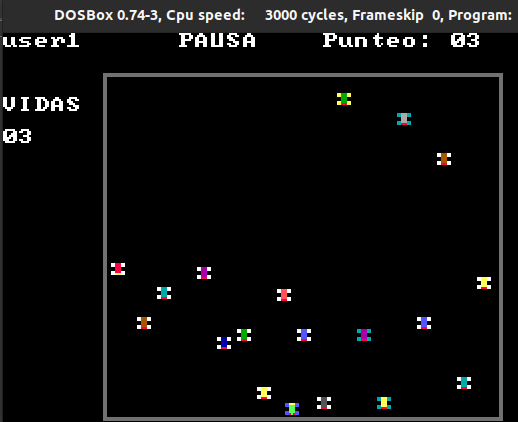

# [Manual Usuario](../README.md)
____________

Identificador y Menu

Opción 2 puede regisrar un usuario, opción 3 sale del programa y opción 1 puede logearse.

si la contraseña no es número muestra contraseña incorrecta.

si usuario ya se encuentra registrado, no podrá volverse a registrar.

Al seleccionar la opción podrá logearse.,si el usuario no existe, muestra une rror donde el usuario fue ingresado incorrectamente.

Al ingresar correctamente se abre el juego.

Tablero inicial del Juego.

Después de darle a la barra espaciado inicia el juego.

Si apretamos escape, muestra la pausa y todo se detiene.

si al colisionar con un coche, se pierde una vida, al llegar a 0 vidas perdemos.

Si al llegar a 25 puntos, podremos ganar y finalizar el juego.

Además si cambiamos de usuario, muestra el nombre de usaurio al que ingresamos, en este caso cambio de user1 a user, debido a que son usuarios diferentes.

 Si en dado caso llegamos a las 0 vidas, hemos perdido. Y nos devuelve al menu principal.

